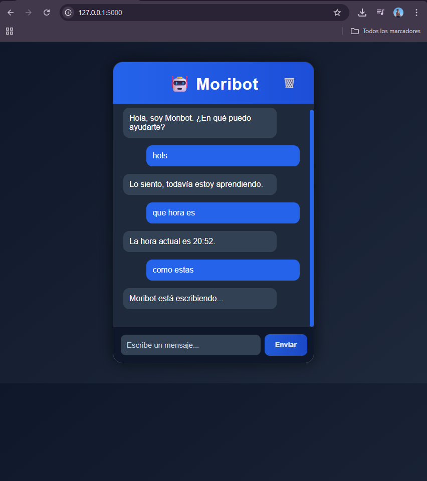
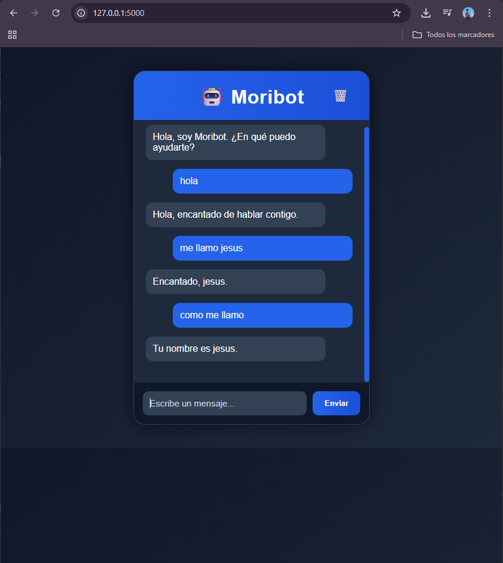
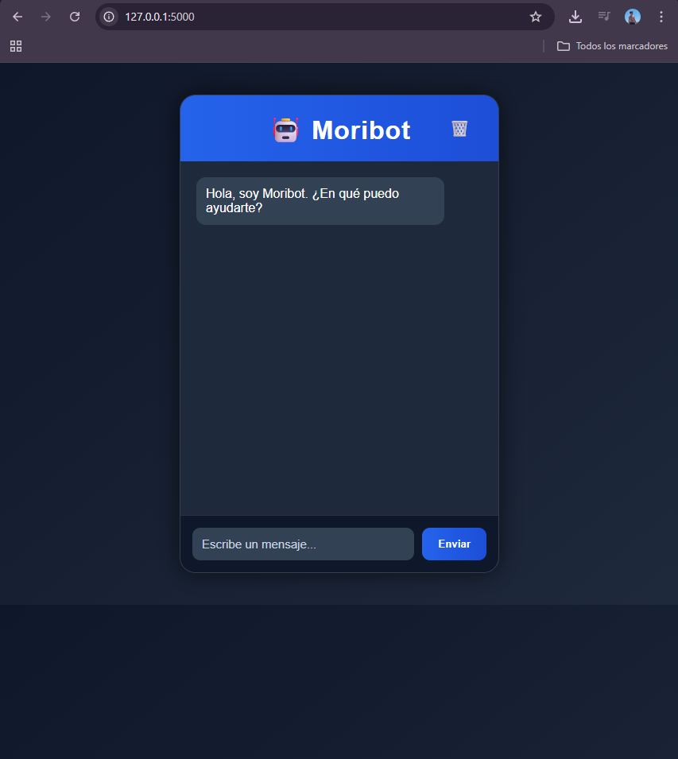

# 🤖 Moribot

Moribot es un chatbot conversacional que he desarrollado utilizando Flask, SQLite, HTML, CSS y JavaScript.

El objetivo principal de este proyecto ha sido aprender a desarrollar una aplicación web completa, combinando backend, frontend y base de datos en una misma aplicación funcional e interactiva.

Además de la funcionalidad básica de chat, he añadido diferentes mejoras visuales y técnicas para conseguir una experiencia mucho más moderna y profesional.

# Funcionalidades del proyecto

✅ Interfaz moderna y responsive  
✅ Tema oscuro con diseño premium  
✅ Chat interactivo en tiempo real  
✅ Backend desarrollado con Flask  
✅ Base de datos SQLite  
✅ Memoria persistente  
✅ Historial automático de conversaciones  
✅ Botón para borrar historial  
✅ Respuestas inteligentes básicas  
✅ Hora y fecha en tiempo real  
✅ Animación “Moribot está escribiendo...”  
✅ Animación de puntos dinámica  
✅ Envío de mensajes con ENTER  
✅ Sonido al recibir respuestas  
✅ Animaciones suaves y efectos visuales modernos  

# Tecnologías utilizadas

Durante el desarrollo del proyecto he utilizado las siguientes tecnologías:

- Python
- Flask
- SQLite
- HTML5
- CSS3
- JavaScript

# Estructura del proyecto

```bash 

moribot/
│
├── app.py
├── requirements.txt
├── README.md
│
├── database/
│   └── chatbot.db
│
├── static/
│   ├── style.css
│   ├── script.js
│   └── sounds/
│       └── message.mp3
│
├── templates/
│   └── index.html
│
├── screenshots/

# Instalación del proyecto

## Clonar repositorio

```bash
git clone https://github.com/TU-USUARIO/moribot.git
```

## Entrar en la carpeta del proyecto

```bash
cd moribot
```

## Instalar dependencias

```bash
pip install -r requirements.txt
```

## Ejecutar la aplicación

```bash
python app.py
```

# Abrir en navegador

```bash
http://127.0.0.1:5000
```

# Capturas del proyecto

## Interfaz principal



## Memoria persistente



## Diseño premium



# Objetivo del proyecto

Con este proyecto he querido aprender y practicar conceptos relacionados con:

- desarrollo backend con Flask,
- manejo de bases de datos SQLite,
- interacción frontend con JavaScript,
- diseño moderno con CSS,
- y arquitectura básica de chatbots conversacionales.

También he buscado desarrollar una aplicación visualmente moderna y agradable para el usuario.

# Autor

Desarrollado por Jesus Morillo.

# Licencia

Proyecto bajo licencia GPL-3.0.